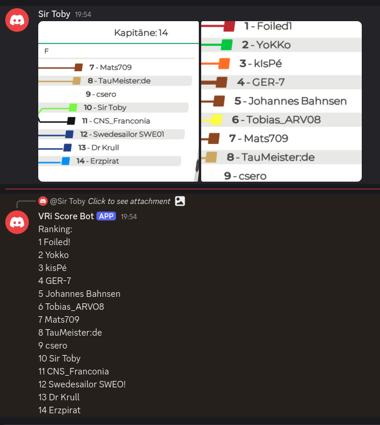
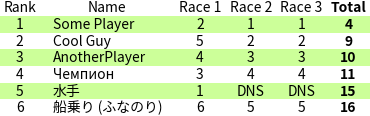

# vri-scores
A tool to quickly extract Virtual Regatta Inshore race results from screenshots

## Features

- **Screenshot OCR:** Automatically extracts race results from screenshots using [Tesseract OCR](https://github.com/tesseract-ocr/tesseract).
- **Text Ranking Parsing:** Supports direct text input with "Ranking:" followed by a list of names.
- **Race Combination:** Combines multiple screenshots in the same message into one race.
- **Emoji Reactions:** Uses number emojis (e.g., 1️⃣, 2️⃣) to label races.
- **Total Score Calculation:** Aggregates scores across races, handling `DSQ`, `DNF`, and `DNS`. Low point scoring system (see the Rule `A4`).
- **Fuzzy Name Matching:** Attempts to correct minor OCR errors in participant names by matching against previously seen names (using Levenshtein distance).
- **Reset Command:** Type `!reset` to clear the bot's internal race data for the channel, allowing a new regatta to start. The last generated table message remains in the chat.
- **Single Table Display:** While a regatta is active, only the latest generated race table is kept in the channel; previous tables for that regatta are automatically deleted upon update.
- **Reaction-Based Updates:** Updates to the race table occur when reacting to a ranking message with a number emoji. Editing a ranking message *does not* automatically update the table; you must re-react.
- **Fast and Responsive:** Fast extraction of race results with a final aggregated table display.

### Example of ranking from a screenshot:


⬆️ As you may notice, the recognition was not ideal in the example above.
This is the reality of fast and cheap OCR.

### Example of a race table after three races:


### Not supported (yet)
- medal races
- worst race[s] exclusion
- non-integer scores
- series ties according to the `A8` Rule

## Installation
```
pip install -r requirements.txt
sudo apt-get install tesseract-ocr  # apt-based Linux
brew install tesseract              # macOS
```

You also need the `fonts-noto-cjk` font.

## Deployment

### Bare Metal

To run on bare metal, simply run:
```bash
python main.py
```
Ensure that Tesseract and required system dependencies are installed as per the [Installation](#installation) instructions.

### Docker

To run using Docker, use the provided `Dockerfile` and `docker-compose.yml`:
```bash
docker-compose up --build
```
This command builds the Docker image and starts the container.

## Support
Now you can buy me a coffee to encourage further development!

[](https://www.buymeacoffee.com/kirienko)
